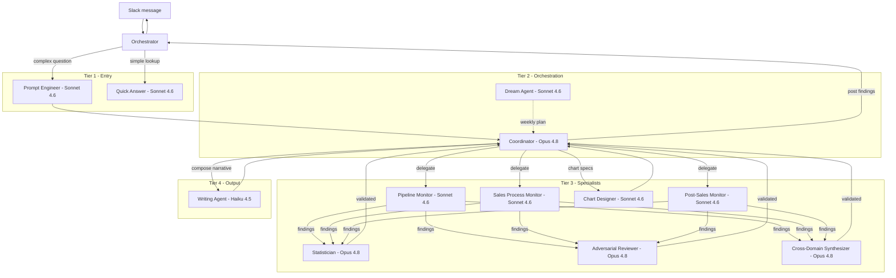

# Architecture

## Overview

GTM Health Agent is an autonomous go-to-market operations analyst for a portfolio
of companies. It watches pipeline health, sales process, and post-sales retention,
and answers ad-hoc questions in Slack with evidence and recommendations. The
reasoning runs on Anthropic's Managed Agents API: a roster of twelve agents across
four tiers, each a cloud-hosted session with its own system prompt, model, and
toolset. The agents do the thinking; they do not run the plumbing.

A Python orchestrator (`orchestrator/`) is the glue. It fronts the system on Slack
(Socket Mode, no public URL needed), schedules recurring work with APScheduler,
runs ad-hoc investigations on a worker thread, dispatches custom tools back to the
agents, and tracks per-session cost. CRM data comes from Salesforce by default,
read live through an Anthropic MCP vault (`soqlQuery` / `describeSObject`) and
mirrored nightly into Postgres so cross-cuts run locally instead of paying per-query
MCP latency. Postgres also persists Slack threads, agent sessions, and cost ledgers.
The whole thing ships as a single Docker service on Railway with a Postgres add-on.

## Agent topology

Agents are defined in `agents/setup_agents.py` and provisioned by the
`agents/provision_*.py` scripts. Each agent's cloud ID lands in an env var
(`COORDINATOR_ID`, `STATISTICIAN_ID`, and so on). No agent IDs are hardcoded.

**Tier 1, Entry.** First contact with an incoming Slack message.

| Agent | Model | Responsibility |
|---|---|---|
| Prompt Engineer | Sonnet 4.6 | Rewrites raw user questions into a structured investigation brief before routing. |
| Quick Answer | Sonnet 4.6 | One-shot lookups (open opp counts, stage definitions): checks memory, hits the CRM, replies. No orchestration. |

**Tier 2, Orchestration.** Owns multi-step work and the nightly plan.

| Agent | Model | Responsibility |
|---|---|---|
| Coordinator | Opus 4.8 | Plans investigations, dispatches specialists in parallel, gates findings through review, hands the user-facing narrative to the Writing Agent, posts to Slack. |
| Dream Agent | Sonnet 4.6 | Runs on a weekly cron. Reads tracked metrics and open questions from memory, generates hypotheses with dollar impact and a test approach, writes a prioritized plan the Coordinator picks up. |

**Tier 3, Specialists.** Domain analysts the Coordinator delegates to.

| Agent | Model | Responsibility |
|---|---|---|
| Pipeline Monitor | Sonnet 4.6 | Lead gen, MQL/SQL rates, scoring, source attribution, routing, response time. |
| Sales Process Monitor | Sonnet 4.6 | Opportunity progression, win rates, cycle time, coverage, rep productivity. |
| Post-Sales Monitor | Sonnet 4.6 | Retention: GRR/NRR by segment, churn-to-channel correlation, ICP fit. |
| Statistician | Opus 4.8 | Validates every quantitative claim: significance, confidence intervals, trend slopes. No claim ships without confidence framing. |
| Adversarial Reviewer | Opus 4.8 | Tries to break each finding before it reaches the user: weak evidence, alternative explanations. |
| Cross-Domain Synthesizer | Opus 4.8 | Connects patterns across pipeline, sales, and retention into one storyline. |
| Chart Designer | Sonnet 4.6 | Turns validated numbers into chart specs (rendered via QuickChart). |

**Tier 4, Output composition.**

| Agent | Model | Responsibility |
|---|---|---|
| Writing Agent | Haiku 4.5 | Composes the final user-facing prose from validated findings. Grounded in a style guide; the Coordinator never writes the narrative itself. |

**Out of roster.** These run in their own sessions, not Coordinator-routed:

- **RFP Responder**: drafts answers to inbound RFP and security questionnaires.
- **RFP Reviewer**: adversarial pass over RFP drafts.
- **Watcher**: watches the orchestrator's own error stream, and (with an
  optional GitHub PAT) opens draft fix-PRs.

## Topology diagram

## The orchestrator

`orchestrator/` is the runtime, not an agent. Key modules:

- **`main.py`**: the process entry point. Boots five concerns: the Slack Socket
  Mode bot (questions and feedback in, answers out), the APScheduler cron (weekly
  Dream plan, recurring sweeps), the investigation worker thread pool, the Watcher
  scheduler tick, and an HTTP server exposing `/health` and `/ready` for Railway
  deploy verification. On startup it calls `recover_interrupted_investigations()`
  to re-pick-up rows left `running` by a dead container.

- **`session_runner.py`**: drives Managed Agent sessions. It creates a session,
  streams events, and handles the custom-tool lifecycle: when an agent calls a
  custom tool the session stops with `stop_reason = requires_action`; the runner
  dispatches the tool, sends back a `user.custom_tool_result` event, and resumes
  the same session (rate-limit backoff resumes rather than restarts). It also
  extracts per-turn usage (`input_tokens`, `cache_read_input_tokens`, cache writes)
  into the cost ledger, and tags each `thread_sessions` row with a config version
  so a prompt deploy invalidates stale sessions instead of resuming them.

- **`data_sources.py`**: the multi-CRM adapter layer. A `DataSourceAdapter` base
  defines `query` / `describe` / `query_next`. Concrete adapters: `SalesforceMcpAdapter`
  (SOQL via the Anthropic MCP vault), `HubSpotAdapter` (REST search JSON), and
  `ZohoAdapter` (COQL). A registry maps a portco's source `type` to the right
  adapter; a platform priority ranking (Salesforce 100, Zoho 90, HubSpot 80, ...)
  breaks ties when more than one source reports the same metric.

- **`portco_registry.py`**: channel-to-portco lookup. Reads `portco_config.json`
  (gitignored; ships as `portco_config.example.json` with a synthetic `acme`
  portco) which maps each company to its data sources, Slack channel, and metadata.
  A message in a portco's channel resolves to that portco; a master channel falls
  back to extracting the portco from the message text.

- **`db_adapter.py`**: the Postgres layer. `ensure_schema()` runs at boot and
  creates every table and view (thread/session persistence, the two-ledger cost
  tables, investigation state) with `CREATE TABLE IF NOT EXISTS`, so a fresh
  database bootstraps with no manual `psql`. It also persists Slack thread to
  session mappings, cost rows, and investigation records.

## Data path

**Live CRM reads.** Specialists query Salesforce through the MCP vault using
`soqlQuery` and `describeSObject`. SOQL has hard limits the query layer respects:
no `CASE`, `COALESCE`, `FLOOR`, or subqueries in `SELECT`; no column aliases in
`ORDER BY`; and long-text / rich-text fields cannot be filtered or aggregated.

**Nightly mirror.** A sync job copies Salesforce into Postgres each night so heavy
cross-cuts (for example `Industry × Product Line`) run on local tables instead of
paying live MCP cost per analysis. Full sync expects four custom `Lead` fields
(`Discovery_Call_Booked__c`, `Funnel_Stage__c`, `MQL_SDR_Accepted_Date_Time__c`,
`SDR_Qualified_Date_Time__c`) and an optional `Opportunity.Product_Line__c`. Missing
fields write `NULL` rather than crashing the row.

**Free-text search.** Because long-text fields can't be filtered in SOQL, free-text
scans (loss-reason notes and the like) follow a query-then-DuckDB pattern: `SELECT`
the field unfiltered into Parquet, scoped by indexed columns, then scan with DuckDB
`regexp_matches`, or run per-row LLM categorization for small universes.

**Ad-hoc two-step.** A typical question separates planning from analysis. A Sonnet
4.6 pass plans the queries (capped, using `GROUP BY` over per-period queries); the
orchestrator runs them; then an Opus 4.8 pass analyzes the collected data in one
call with extended thinking, leading with the most critical finding, comparing to
benchmarks, and recommending actions. Output is formatted for Slack mrkdwn and split
to respect the 3000-character block limit.

## Memory

Two Anthropic memory stores attach to every session:

- **Methodology** (read-only): the GTM analysis playbook, seeded from
  `skills/gtm-methodology.md`. How to compute GRR/NRR, what benchmarks to compare
  against, how to frame confidence. Agents read it; they never write it.

- **Health** (read-write, per-portco): operational state for each company under a
  per-portco subdirectory: tracked metrics, open questions, active findings, resolved
  investigations, and a `/instructions.md` file the Slack feedback path writes to so
  future sessions absorb corrections. Per-portco subdirectories keep companies
  isolated from each other.

## Deployment

The service runs as a single Docker image on Railway, paired with the Railway
Postgres add-on (which injects `DATABASE_URL`; the schema auto-bootstraps on first
boot). The image is built from the repo `Dockerfile`; `railway.toml` pins the
service and the `/health` healthcheck.

**BUILD_COMMIT discipline.** The image takes `BUILD_COMMIT` as a build arg
(`--build-arg BUILD_COMMIT=$(git rev-parse HEAD)`), which `/health` echoes back.
This is how you confirm a deploy actually shipped the commit you intended. Auto-Deploy
is left OFF; ship deliberately with `bin/deploy.sh` from a clean checkout on `main`.

**Health endpoints.** `/health` returns 200 as soon as the process is up (Railway
liveness). `/ready` returns 200 only after the startup smoke probe passes; until
then Railway holds the previous image, so a half-broken deploy never takes traffic.
