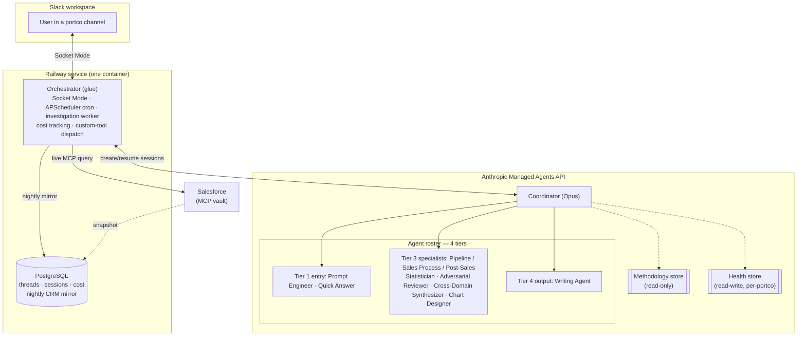
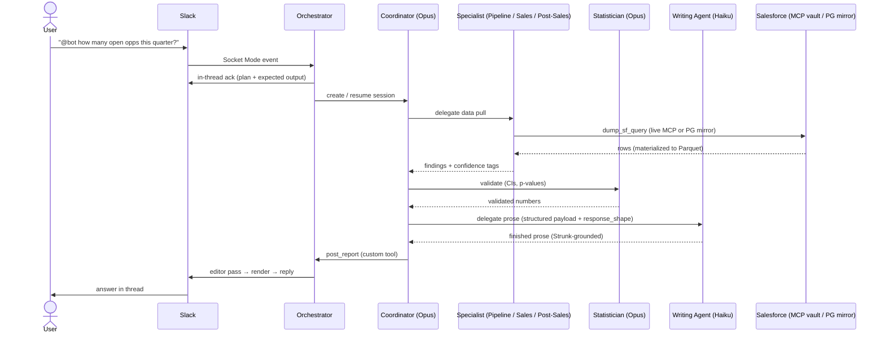

# GTM Health Agent

An autonomous go-to-market (GTM) operations analyst for a PE firm and its portfolio companies. It watches pipeline health, sales process, and retention across each portco, and answers ad-hoc questions in Slack. A Python orchestrator bridges Slack, a CRM (Salesforce by default, reached through Anthropic MCP vaults), and Claude running on the Anthropic Managed Agents API. State and a nightly CRM mirror live in PostgreSQL; the whole thing deploys to Railway. This repository is a **forkable template**: every owner-specific identifier comes from environment variables and a gitignored `portco_config.json`, so you can stand up your own instance against your own Slack workspace, CRM, and Anthropic org without editing source.

[](LICENSE)
[](pyrightconfig.json)
[](https://docs.anthropic.com)

## How it works

A question arrives in a Slack channel mapped to a portco. The orchestrator (running Slack Socket Mode, an APScheduler cron, and an investigation worker thread) routes it to the Anthropic Managed Agents API. A Coordinator agent fans the work out to a roster of specialist agents across four tiers, then hands the validated result to a Writing Agent for the final prose before it returns to Slack. Specialists read CRM data through an MCP vault for live queries, or from a Postgres mirror that the orchestrator refreshes nightly for historical lookups. Two Anthropic memory stores attach to every session: a read-only Methodology store and a read-write Health store that holds per-portco operational state. The orchestrator itself is glue, not an agent: it owns the Slack connection, the cron schedule, the worker thread, per-session cost tracking, and custom-tool dispatch. Everything runs inside one Railway service alongside a Railway Postgres add-on.



## Prerequisites

You provision five required services and, optionally, up to five more. Everything is set through environment variables — nothing is hardcoded.

| Service | Why | Required? | Where to get it | Env var(s) |
|---|---|---|---|---|
| Anthropic Managed Agents | Hosts the Coordinator and all sub-agents; minted by `agents/setup_agents.py`. Enable the Managed Agents beta (`managed-agents-2026-04-01`). | **Required** | [console.anthropic.com](https://console.anthropic.com) | `ANTHROPIC_API_KEY`, `ENVIRONMENT_ID`, `COORDINATOR_ID`, `DREAM_AGENT_ID`, `QUICK_AGENT_ID`, the specialist `*_ID`, `METHODOLOGY_STORE_ID`, `HEALTH_STORE_ID` |
| Slack app | The human interface: Socket Mode events in, mrkdwn replies out. Created "From an app manifest" using `manifest.yaml`. | **Required** | [api.slack.com/apps](https://api.slack.com/apps) | `SLACK_BOT_TOKEN` (xoxb), `SLACK_APP_TOKEN` (xapp), `SLACK_CHANNEL_ID` |
| Salesforce (or another CRM) | The GTM data source. Connected App with OAuth; per-portco creds named in `portco_config.json`. Needs 4 custom Lead fields (below). | **Required** | [salesforce.com](https://www.salesforce.com) | `SF_CONSUMER_KEY_<PORTCO>`, `SF_CONSUMER_SECRET_<PORTCO>`, `SF_DOMAIN_<PORTCO>` (OAuth, preferred) or `SF_USERNAME/PASSWORD/TOKEN_<PORTCO>` (SOAP) |
| Railway | Hosts the orchestrator container and injects `DATABASE_URL` from the Postgres add-on. | **Required** | [railway.app](https://railway.app) | `BUILD_COMMIT` (build-time), `PORT` |
| PostgreSQL | Thread/session/cost persistence and the nightly CRM mirror. Schema auto-bootstraps at boot. | **Required** | Railway Postgres add-on | `DATABASE_URL` |
| Anthropic Admin API key | Daily cost reconciliation against Anthropic's ground-truth Usage & Cost API. Local ledger and `/bot-token-cost` work without it. | Optional | Anthropic Console → Settings → API Keys → Admin keys | `ANTHROPIC_ADMIN_KEY` (sk-ant-admin-...) |
| Kapa.ai | Optional internal knowledge base (Confluence / Jira / help-docs). Config-gated by `data_sources.knowledge.enabled`; tool name `search_knowledge_base`. Forks without a KB run fine. | Optional | [kapa.ai](https://www.kapa.ai) | `KAPA_<PORTCO>_API_KEY`, `KAPA_<PORTCO>_PROJECT_ID` |
| Compresr | Prompt compression on the two large Messages-API call sites. Fails open — compression failure never breaks a call. | Optional | [compresr.ai](https://compresr.ai) | `COMPRESR_API_KEY` (cmp-...) |
| GitHub fine-grained PAT | Lets the Watcher open draft fix-PRs against this repo. | Optional | [github.com/settings/tokens](https://github.com/settings/tokens) | `WATCHER_GH_TOKEN` |
| QuickChart | Chart rendering for the Chart Designer agent. Basic use needs no key. | Optional | [quickchart.io](https://quickchart.io) | none (basic) |

`<PORTCO>` is the uppercased portco key from `portco_config.json` (for example, the `acme` portco reads `SF_CONSUMER_KEY_ACME`). The names of these env vars are declared per portco in `portco_config.json`, so you control them.

**Salesforce custom fields.** For the nightly sync to write complete rows, the `Lead` object needs four custom fields: `Discovery_Call_Booked__c`, `Funnel_Stage__c`, `MQL_SDR_Accepted_Date_Time__c`, and `SDR_Qualified_Date_Time__c`. An optional `Product_Line__c` on `Opportunity` enables cross-cuts like Industry × Product Line from Postgres. Missing fields are written as `NULL` rather than crashing the sync. See [CONFIGURATION.md](CONFIGURATION.md) for the field-by-field detail and backfill scripts.

**Snapshot retention.** The nightly sync appends a full copy of every object under a new snapshot, so Postgres would grow unboundedly without retention. A three-tier model bounds it: a compact per-portco-per-day `daily_metrics` rollup kept forever (the "pipeline on date X" layer), an optional Parquet cold archive of the full raw rows to an S3-compatible bucket kept forever off-volume, and a hot-window purge that drops only the bulky raw rows older than `RAW_HOT_WINDOW_DAYS` (default 60) once the rollup — and, when enabled, the archive — is confirmed. The archive is off by default; turn it on with `ARCHIVE_BUCKET_ENABLED=true` and the `ARCHIVE_S3_*` credentials (an S3-compatible bucket such as a Railway object-storage bucket). It adds one dependency, `boto3`. See [ARCHITECTURE.md](ARCHITECTURE.md) for the tier model and [CONFIGURATION.md](CONFIGURATION.md) for every env var.

## Quickstart

Run a local instance against your own Slack workspace, CRM, and Anthropic org.

```bash
# 1. Clone
git clone https://github.com/your-org/gtm-health-agent.git
cd gtm-health-agent

# 2. Create a virtualenv and install deps (Python 3.12)
python3.12 -m venv .venv
source .venv/bin/activate
pip install -r orchestrator/requirements.txt

# 3. Fill in secrets
cp .env.example .env
# Edit .env and set at minimum:
#   ANTHROPIC_API_KEY   (sk-ant-...)
#   SLACK_BOT_TOKEN     (xoxb-...)
#   SLACK_APP_TOKEN     (xapp-...)
#   SLACK_CHANNEL_ID    (C...)
#   DATABASE_URL        (postgres://...  — from your Railway Postgres add-on)

# 4. Configure your portcos
cp portco_config.example.json portco_config.json
# Edit portco_config.json: rename the synthetic "acme" portco, point it at your
# Slack channel, and name your CRM credential env vars. portco_config.json is
# gitignored — your real config never enters version control.

# 5. Mint the agents, environment, and memory stores
python agents/setup_agents.py
# Creates and prints all 11 roster agents plus the environment and both memory stores.
# Paste every printed ID into .env: ENVIRONMENT_ID, COORDINATOR_ID,
# DREAM_AGENT_ID, QUICK_AGENT_ID, PIPELINE_MONITOR_ID, SALES_MONITOR_ID,
# POSTSALES_MONITOR_ID, STATISTICIAN_ID, CHART_DESIGNER_ID,
# ADVERSARIAL_REVIEWER_ID, CROSS_DOMAIN_SYNTHESIZER_ID, WRITING_AGENT_ID,
# METHODOLOGY_STORE_ID, HEALTH_STORE_ID. Then provision the standalone agents:
python agents/provision_prompt_engineer.py    # -> PROMPT_ENGINEER_ID
python agents/provision_rfp_agent.py          # -> RFP_RESPONDER_ID  (optional)
python agents/provision_rfp_reviewer_agent.py # -> RFP_REVIEWER_ID   (optional)
python agents/provision_watcher_agent.py      # -> WATCHER_AGENT_ID  (optional)

# 6. Run the orchestrator (Slack bot + cron + investigation worker)
cd orchestrator && python main.py

# 7. Confirm it is alive
curl http://localhost:8080/health
# -> {"build_commit": "...", "status": "ok", "active_versions": {...}, ...}
```

The Postgres schema **auto-bootstraps** on first boot (`db_adapter.ensure_schema` plus the migrations in `orchestrator/migrations/`). There is no manual `psql` step. Once `/health` returns `status: ok`, message the agent in your configured Slack channel.

To run the test suite (note the non-default `*_test.py` suffix):

```bash
pytest -p no:cacheprovider -o python_files='*_test.py' orchestrator agents bin
pyright                                   # type-check, Python 3.12
ruff check orchestrator agents bin scripts
```

## Deploy (Railway)

The orchestrator ships as a Docker image. The `/health` endpoint reports the commit it was built from, so the deploy can verify Railway is running the SHA you just shipped rather than a stale image.

1. **Create the project and add Postgres.** In [railway.app](https://railway.app), create a project, add a service from this repo's `Dockerfile`, then add the **PostgreSQL** plugin. The plugin injects `DATABASE_URL` automatically.
2. **Set environment variables.** Copy everything from your `.env` into the Railway service Variables (Anthropic, Slack, CRM, agent IDs). `portco_config.json` is gitignored, so a GitHub/Railway build won't contain it — supply it as a `PORTCO_CONFIG_JSON` variable (raw or base64 JSON), which `portco_registry` loads before the on-disk file. (A local `docker build` with the file present copies it in directly.)
3. **Pin `BUILD_COMMIT` at build time.** The `Dockerfile` reads `ARG BUILD_COMMIT`, falling back to Railway's `RAILWAY_GIT_COMMIT_SHA`. Set `BUILD_COMMIT` as a build-time variable, or let the Railway-provided SHA flow through. A local build looks like:
   ```bash
   docker build --build-arg BUILD_COMMIT=$(git rev-parse HEAD) -t gtm-health-agent .
   ```
4. **Turn Auto-Deploy OFF.** In the Railway service Settings → Source, set **Auto Deploy = OFF**. The sanctioned deploy path is the script below; auto-deploy races it. This is a manual dashboard toggle (`railway.toml` cannot set it).
5. **Deploy.** From a clean checkout of `main`:
   ```bash
   bin/deploy.sh
   ```
   The script refuses a dirty tree and a non-`main` branch, sets `BUILD_COMMIT` as a Railway variable before the build, then ships.
6. **Verify.** Curl the public `/health` and confirm `build_commit` matches the SHA you just deployed (not `unknown`, not a stale SHA):
   ```bash
   curl https://<your-service>.up.railway.app/health
   ```

## Adopting this for your company

The [Quickstart](#quickstart) above is the copy-paste path. This is the higher-level narrative for what you are actually standing up and in what order. Each step ends with a concrete artifact the next step needs. Budget two to three hours for a first run — most of it is waiting on external consoles, not on code. The first-run detail for every step lives in [docs/getting-started.md](docs/getting-started.md).

**1. Decide whether this fits.** You are running an autonomous GTM analyst that watches one or more portcos' CRM data and answers questions in Slack. It is a fit if your GTM data lives in Salesforce (default) or another supported CRM, your team works in Slack, and your Anthropic org can get the Managed Agents beta (`managed-agents-2026-04-01`). That beta is the hard blocker — without it the agents cannot run at all. Everything else degrades gracefully.

**2. Provision the five required services.** Stand these up first; collect the token or ID from each before moving on. The optional services (Anthropic Admin key, Kapa, Compresr, GitHub PAT, QuickChart) can wait — see the [Prerequisites](#prerequisites) table.

   1. **Anthropic Managed Agents** — [console.anthropic.com](https://console.anthropic.com). Mint a standard API key (`sk-ant-...`) under Settings → API Keys and confirm the Managed Agents beta is enabled for your org. Sets `ANTHROPIC_API_KEY`. The agent and store IDs come later in step 4, not here.
   2. **Slack app** — [api.slack.com/apps](https://api.slack.com/apps). Create the app "From an app manifest" with the repo's `manifest.yaml` (this declares scopes, slash commands, and event subscriptions for you), enable Socket Mode and mint the app-level token (`connections:write`), then install to the workspace. Sets `SLACK_APP_TOKEN` (xapp-), `SLACK_BOT_TOKEN` (xoxb-), and `SLACK_CHANNEL_ID` (the channel you invite the bot into).
   3. **Salesforce** — [salesforce.com](https://www.salesforce.com). Create a Connected App with the OAuth client-credentials flow and add the four custom `Lead` fields (and optional `Opportunity.Product_Line__c`). Sets the per-portco `SF_CONSUMER_KEY_<PORTCO>`, `SF_CONSUMER_SECRET_<PORTCO>`, `SF_DOMAIN_<PORTCO>`. For live MCP reads, first create an Anthropic MCP vault in the console, set `<PORTCO>_VAULT_ID` to its `vlt_...` id, then attach your Salesforce credential *into* that vault with `python bin/add-sf-vault-credential.py --apply --vault-id vlt_...` (the script consumes a vault you already made and creates a credential inside it — it does not create the vault or set the env var for you). Historical Postgres-mirror queries work without a vault; only live MCP reads need it.
   4. **Railway** — [railway.app](https://railway.app). Create a project and add a service from this repo's `Dockerfile`. Hosts the one orchestrator container; injects `PORT` and reads `BUILD_COMMIT` at build time.
   5. **PostgreSQL** — the Railway Postgres add-on. Adding it injects `DATABASE_URL` automatically; the schema auto-bootstraps at first boot via `db_adapter.ensure_schema()` plus the migrations in `orchestrator/migrations/`. There is no manual `psql` step.

**3. Configure `portco_config.json`.** Copy the example (`cp portco_config.example.json portco_config.json` — the real file is gitignored), rename the synthetic `acme` portco to your own lowercase key, set `name`/`fund`/`status: "active"`, point `slack_channel` at the channel ID from step 2, and set `data_sources.crm.vault_id` plus the `sf_credentials` env-var names to match what you exported. That portco key is the uppercase suffix on every `SF_*` and `<PORTCO>_VAULT_ID` variable. Channel-to-portco resolution then runs automatically in `orchestrator/portco_registry.py`.

**4. Mint the agents.** Run `python agents/setup_agents.py` once. It creates the cloud environment, all 11 roster agents, and both memory stores, then prints a `# --- Copy to .env ---` block — paste every ID in (`ENVIRONMENT_ID`, `COORDINATOR_ID`, the specialist `*_ID`s, `WRITING_AGENT_ID`, `METHODOLOGY_STORE_ID`, `HEALTH_STORE_ID`). Then provision the standalone agents that run outside the Coordinator's roster: `python agents/provision_prompt_engineer.py` (→ `PROMPT_ENGINEER_ID`), and optionally `provision_rfp_agent.py`, `provision_rfp_reviewer_agent.py`, and `provision_watcher_agent.py`. Unset standalone IDs degrade rather than crash — an unset `PROMPT_ENGINEER_ID` just skips question refinement.

**5. Deploy on Railway.** Set every variable from your `.env` in the Railway service Variables tab, and supply your gitignored config as `PORTCO_CONFIG_JSON` (raw or base64 JSON) since the build image won't contain the file. Turn **Auto Deploy OFF** in Settings → Source (auto-deploy races the sanctioned path), then ship from a clean checkout on `main` with `bin/deploy.sh`. The script refuses a dirty tree or a non-`main` branch, sets `BUILD_COMMIT` as a Railway variable before the build so `/health` reports the exact SHA, and runs the detached deploy.

**6. Verify `/health` and ask the first question.** Curl `/health` on your service's public URL and confirm `build_commit` matches the SHA you just deployed (not `unknown`, not a stale SHA). Then, in your `SLACK_CHANNEL_ID` channel, mention the bot with a real question — for example, "how many open opportunities are there this quarter?" You should see an in-thread acknowledgment with a plan, then a posted answer. If it acknowledges but never answers, check the orchestrator logs for the investigation worker and the Salesforce MCP vault connection.

Adding a second portco after this is config plus credentials, no code: a new key under `portcos`, that portco's `SF_*` vars, a new Slack channel, and a redeploy. See [docs/getting-started.md §9](docs/getting-started.md).

### What a question's round-trip looks like



<!-- screenshot: drop a real, SANITIZED Slack screenshot of the bot answering here -->

## Documentation

- [docs/getting-started.md](docs/getting-started.md) — first-run walkthrough from zero to a working agent.
- [CONFIGURATION.md](CONFIGURATION.md) — every env var, `portco_config.json` field, CRM credential mode, and the Salesforce custom-field requirements.
- [ARCHITECTURE.md](ARCHITECTURE.md) — the twelve agents, four tiers, memory stores, session lifecycle, and the orchestrator's internals.
- [CONTRIBUTING.md](CONTRIBUTING.md) — dev setup, the `*_test.py` convention, lint/type-check gates, and PR expectations.
- [SECURITY.md](SECURITY.md) — secret handling, the portco-identifier scrub gate, and how to report a vulnerability.
- [docs/runbooks/](docs/runbooks/) — operational runbooks: prompt rollback, smoke probe, Managed Agents conformance, and the symptom-indexed runbook directory.

## License

Apache-2.0. See [LICENSE](LICENSE).
